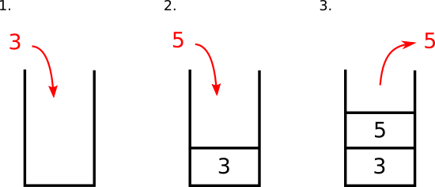
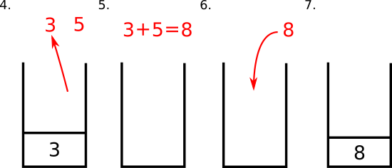

# 堆疊

我們的腦袋在做數學運算的時候，會很自然的把算完的結果記憶在腦海裡。電腦在運算的時候也會有暫時記憶運算結果的元件，也就是暫存器

一般 X86 架構的電腦 \(EX: 你的PC\)，或是 ARM 架構的電腦 \(EX: 大部分的 Android 手機\) 使用固定數量，且各具有特定功能的暫存器來暫時儲存要處理的資料，不過 Wasm 並不是使用暫存器，而是透過 `堆疊`  來儲存暫時要處理的資料，因此我們首先介紹 Wasm 中的堆疊機制

## 堆疊是什麼?

堆疊是一種資料結構，顧名思義，就是把東西堆成一疊

如果你有像這樣堆東西的經驗 \(沒有的話自己試一下\)，當你把新的書放上去的時候，他會在整堆的最上面；而在你要拿中間的某本書之前，在不能從中間抽走的前提下，必須要先把那本書上面的書，都先從最上面一本本拿走，才能拿到你要的書。因此，最後放進去的必須要最先拿出來，所以是一種 **後進先出** 的資料結構

---

## 堆疊在虛擬機中的運作

堆疊最基本的操作有2個

1. push 把東西放進去

2. pop 把東西拿出來

以 3 + 5 這個運算為例，在虛擬機內部就會有以下的步驟:

當然，有些步驟是內部操作，你在編寫的時候不一定需要寫出來，不過還是要對這些步驟有點概念

---

### Wasm 堆疊中的資料種類

1. 數值 \(Value\)

   一般的運算資料，在[數值型別](value.md)章節中會有詳細說明

2. 標籤 \(Label\)

   在會影響結構的控制指令 \(Structured control instructions\) 中，用來區分各個區塊 \(block\)的標記。在[算術、參數和控制指令](simple-instructions.md)章節中會有詳細說明

3. 堆疊框 \(Frame\)

   記錄正在執行中的函式的屬性資料，在[函式](function.md)章節中會有詳細說明

