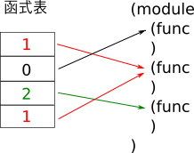

# 函式表

WebAssembly 的 table 其實在構想上不只支援函式當作裏面的元素，不過目前的規格還是只有支援函式，所以我就暫時把 table 稱為函式表，避免大家聯想太多

函式表其實就是一個裏面放有函式位置的表，之後可以根據函式表上記錄的位置，間接的呼叫函式



## 函式表宣告

基本上和 memory 差不多，一樣是宣告在 module 裡，只能有一個

```text
(module
    (table 0 3 anyfunc)
)
```

第一個數字是最小值，表示一開始的大小

第二個數字是最大值，可加可不加。如果沒有指定最大值，之後指定函式表數值的時候，數值位址沒有上限

anyfunc 是函式表型別，誠如之前所說，目前的規格只有支援函式，所以固定是 anyfunc

另外也一樣可以指定名稱

```text
(module
    (table $ddd 0 3 anyfunc)
)
```

## 指定函式表的值

Table 的指定不再是用指令來操作，而是在 module 裡的 elem 宣告

```text
(module
    (func $aaa
    )
    (func
    )
    (func
    )
    (table $ddd 0 3 anyfunc)
    (elem 0 (i32.const 1) 2 $aaa)
)
```

第一個 0 表示要指定編號為 0 的 table，由於目前在 WebAssembly 規格裡每個模組只能有一個 table，所以基本上只能是 0，或是 table 的名稱

後面的 i32.const 1 表示要從編號第 1 的位置開始指定


如果 table 有設定最大值，指定的位址 + 元素個數不可以超過最大值

elem 宣告也可以不只一個，如果指定的範圍有重複，以最下面的宣告為主

```text
(module
    (func $aaa
    )
    (func
    )
    (func
    )
    (table $ddd 0 3 anyfunc)
    (elem 0 (i32.const 0) 1 0)
    (elem $ddd (i32.const 1) 2 $aaa)
)
```

## 間接呼叫函式

* **call\_indirect**
  * 後面接一個整數，表示 table 中某個元素的位址。根據那個位址，從 table 中取出函數的編號，再透過編號呼叫函式

